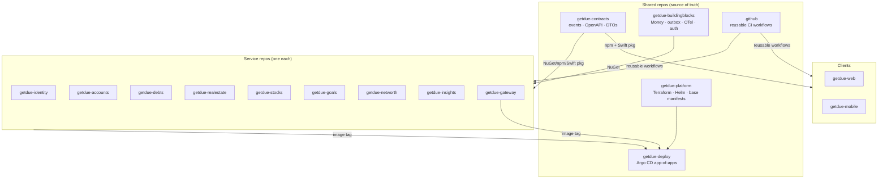
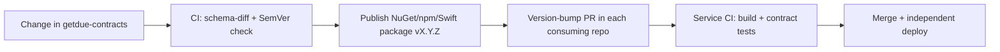

# 01 · Repositories & Contracts (Multi-Repo Strategy)

GetDue uses a **polyrepo** model: **one repository per microservice**, plus a small set of **shared repos** that
distribute contracts and common libraries as **versioned packages**. This gives each service independent delivery,
isolated access, and a blast radius of one.

## 0. Ownership & GitHub Flow (Phase 0)

Phase 0 is **solo-maintained** in the `getdue-dev` GitHub organization. The repo workflow is deliberately
minimal — plain **GitHub Flow** on top of two settings:

- **All repositories are public.** The org is on the **GitHub Free** plan, where branch protection only applies to
  public repos — keeping repos public is what lets every repo carry a protected `main` with no paid upgrade.
- **The default branch (`main`) is protected:** work happens on a **feature branch**, lands via a **pull request**,
  and **CI must be green** to merge. **No direct pushes** to `main` and **no force-push**. (Full rule set in §7.)

That is the whole governance surface for the solo phase. Heavier controls (multiple reviewers, separation of duties,
etc.) are an organisational decision for when a team forms — they are not configured now and are out of scope for
these docs.

## 1. Repository map



## 2. Repository inventory

All repos are **public** in the `getdue-dev` org.

| Repo | Type | Publishes |
|---|---|---|
| `getdue-identity` … `getdue-insights` (8) | Service | container image |
| `getdue-gateway` | Edge | container image |
| `getdue-web` | Client | container image |
| `getdue-mobile` | Client | App Store build |
| `getdue-contracts` | Shared | NuGet `GetDue.Contracts.*`, npm `@getdue/contracts`, `GetDueContracts` Swift package |
| `getdue-buildingblocks` | Shared | NuGet `GetDue.BuildingBlocks.*` |
| `getdue-platform` | Infra | Helm charts, Terraform modules (tagged) |
| `getdue-deploy` | GitOps | — (declarative state) |
| `.github` | Org config | reusable CI workflows |

## 3. The contracts repo (`getdue-contracts`)

The single **source of truth** for everything that crosses a service boundary:

- **Integration events** — message schemas for the broker (`PropertyValued`, `GoalContributed`, `BalanceChanged`, …),
  versioned and backward-compatible.
- **OpenAPI specs** — each service's public API fragment; the gateway aggregates them.
- **Shared DTOs / enums** — `Money`, `Currency`, enum definitions used in payloads.

**Distribution (multi-language, since clients are TS + Swift):**

| Consumer | Package | Generated via |
|---|---|---|
| C# services | NuGet `GetDue.Contracts` | source-gen from schema |
| Next.js web | npm `@getdue/contracts` + `openapi-typescript` | CI codegen |
| SwiftUI mobile | Swift package + `swift-openapi-generator` | CI codegen |

**Rules:**
- Contracts are **versioned with SemVer**; a **breaking change requires a major bump** and an ADR.
- Backward compatibility is **CI-enforced** (schema-diff gate) — additive changes only within a major version.
- A service may **only** depend on a **published, tagged** contracts version — never a branch or a local path.
- Event schemas carry an explicit `schemaVersion`; consumers tolerate unknown fields (tolerant reader).

## 4. Shared library repo (`getdue-buildingblocks`)

Common C# primitives so services stay consistent **without sharing domain logic**: `Money` value object,
transactional outbox + relay, **idempotency-key middleware** ([04 §5](../phase-0/04-api-design.md#5-idempotency-keys)),
OpenTelemetry bootstrap, JWT auth handlers, Polly resilience policies, problem-details middleware. Published as NuGet
packages, consumed via pinned versions. **No business/domain code** lives here — that would couple services.

## 5. Versioning & dependency flow



- **SemVer everywhere**; pinned versions in each repo (no floating ranges).
- An **automated dependency-update bot** opens version-bump PRs across consuming repos.
- **Consumer-driven contract tests** (Pact-style or schema validation) run in each service's CI so a contract bump
  can't silently break a consumer.

> The full cross-layer versioning rules — API majors, service/image tags, event `schemaVersion`, DB migration
> compatibility, infra/GitOps — are defined in **[02 · Versioning System](./02-versioning.md)**.

## 6. CI/CD per service repo

Each service repo runs the **same reusable workflow** (`.github`), so the pipeline is uniform:

```
build → unit + integration tests → 100% coverage gate + mutation gate (03) → architecture tests →
SAST + secret scan + SCA + IaC scan + container scan →
SBOM + image sign (cosign) → publish image to registry →
bump image tag in getdue-deploy (GitOps) → Argo CD rolls out (2–3 pods)
```

The security gates above are the supply-chain side of the pipeline; their thresholds and the secure-SDLC rules live in
**[04 · Secure SDLC](./04-secure-sdlc.md)**.

## 7. Branch protection (all repos)

- **Repos are public** in the `getdue-dev` org — this is what lets classic branch protection work on the GitHub
  Free plan (it returns 403 for private repos on that plan).
- **Protected default branch (`main`):** no direct pushes; **PR required** from a feature branch; **no force-push**
  and **no deletion**.
- **Required status checks (strict):** all CI gates in §6 must pass and the feature branch must be **up to date with
  `main`** before merge — **no merge on red**, no stale merges. In the solo phase the maintainer self-merges once CI
  is green (`required_approving_review_count: 0`, `enforce_admins: false`).
- **Linear history:** merges are squash/rebase only, keeping `main` linear (matches the feature-branch flow).
- **Conversation resolution required:** every PR review thread must be resolved before merge.
- **Signed commits required:** every commit on `main` must carry a verified GPG/SSH signature.
- **Auto-delete merged branches:** merged feature branches are cleaned up automatically (branch → PR → merge).
- **`CODEOWNERS`** makes the maintainer the default owner, so they're auto-requested as a reviewer on every PR — a
  request, not a gate, in the solo phase (you can't approve your own PR, so requiring it would block self-merge).
- **`SECURITY.md`** is checked in to every repo, pointing at the secure-SDLC doc.

## 8. Local development across repos

Polyrepo must not slow developers down:

- `getdue-platform` ships a **Docker Compose mesh** that pulls published service images + Postgres/Redis/RabbitMQ +
  the Grafana stack — one command to run the whole system locally.
- Working on one service? Run that service from source and the rest from images.
- A `getdue` meta CLI / workspace script clones and updates all repos in one go.

## 9. Trade-offs (recorded honestly)

| Benefit | Cost | Mitigation |
|---|---|---|
| Independent deploy/rollback, blast radius = 1 | Cross-repo coordination | contracts/buildingblocks packages + dependency-update bot |
| Per-repo isolation & branch protection | More repos to manage | `.github` reusable workflows shared across repos |
| Clear ownership boundaries | Version-bump churn | automated PRs + consumer-driven contract tests |
| Clean audit trail per service | Harder "atomic" cross-service change | versioned, backward-compatible contracts (never break in lockstep) |
