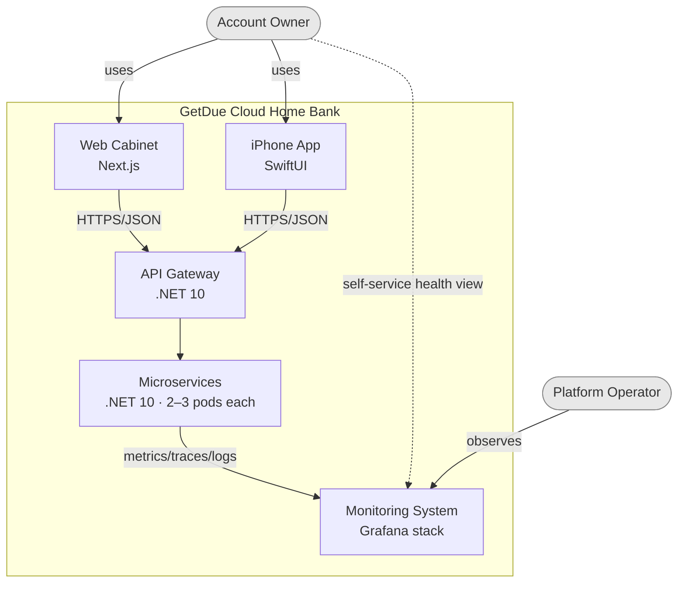
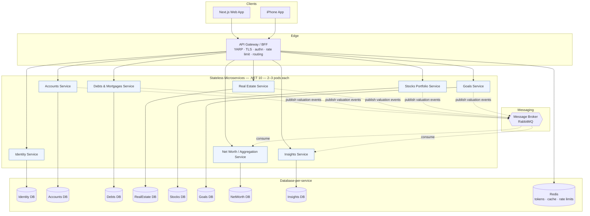
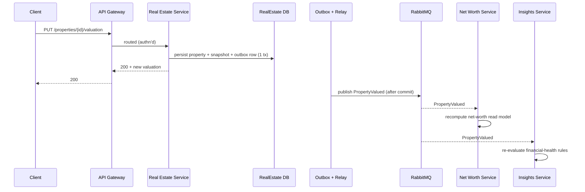
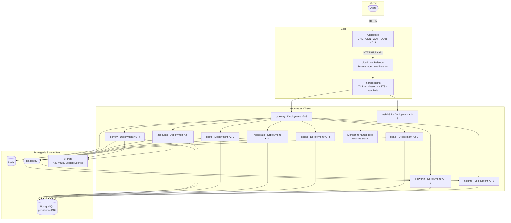

# 01 · Architecture

## 1. Architectural principles

| Principle | Consequence in Phase 0 |
|---|---|
| **One backend API surface, many clients** | An API gateway fronts the services; clients hold no business logic |
| **Stateless microservices** | Each service is horizontally scalable, runs **2–3 pods**, keeps **no in-pod state** — all state lives in Postgres / Redis / the message broker, so any pod can serve any request |
| **Clean Architecture + DDD per service** | Every service has pure-C# Domain; infra (EF, HTTP) depends inward, never the reverse |
| **Database-per-service** | Each service owns its schema; no service reads another's tables — only its API or its events |
| **Event-driven integration** | Services integrate through a **message broker** + transactional outbox; sync calls only where unavoidable |
| **Event-sourced valuations** | Entity value changes are append-only snapshots → net-worth history for free |
| **Observable by construction** | OpenTelemetry baked in from line one; traces span service-to-service hops |
| **Money never moves** | No payment side effects; the system is a *ledger of record*, not a processor |

> **Statelessness, concretely:** no sticky sessions, no in-memory caches that must survive a restart, no local file
> state. Auth tokens, rate-limit counters, and read caches live in **Redis**; durable data in **PostgreSQL**;
> in-flight integration events in the **broker**. A pod can be killed and replaced at any moment with zero data loss —
> which is exactly what lets every service run 2–3 interchangeable replicas behind a load balancer.

## 2. C4 — System Context



> Note: **no external financial systems** appear in this context diagram — that is the defining property of Phase 0.

## 3. C4 — Container view (microservices)



### Services (each = one bounded context, one DB, 2–3 stateless pods)

| Service | Aggregate roots | Owns DB | Responsibility |
|---|---|---|---|
| **Identity** | `User`, `Household` | identity-db | Registration, login, membership, profile, token issuance |
| **Accounts** | `BankAccount` | accounts-db | Manual bank accounts + balance snapshots |
| **Debts & Mortgages** | `LoanDebt`, `MortgageLoan` | debts-db | Outstanding balances, schedules, recorded payments |
| **Real Estate** | `Property` | realestate-db | Property records + valuation snapshots |
| **Stocks Portfolio** | `Portfolio`, `Holding` | stocks-db | Positions, manual/seeded prices, market value |
| **Goals** | `FinancialGoal` | goals-db | Targets, contributions, progress |
| **Net Worth / Aggregation** | `ValuationSnapshot` (read model), `ExchangeRate`, dashboard read models | networth-db | Cross-service aggregation + history + **multi-currency FX conversion** + **client dashboard/analytics** read models ([10](./10-dashboard-analytics.md)), built from events |
| **Insights** | `Insight` | insights-db | Financial-health rules → insights/alerts (see [05](./05-monitoring.md)); consumes valuation/goal events via the broker (no cross-service DB reads) |

> Services **never** read each other's databases. They integrate two ways:
> **(a) asynchronously** via valuation/domain events on the broker (the default), and
> **(b) synchronously** via the gateway/service API only when a request truly needs another service's current state.

## 4. Per-service internal architecture (Clean Architecture)

Every microservice is the same four-project shape — identical structure, different bounded context:

```
┌──────────────────────────────────────────────────────────────┐
│  *.Api            (ASP.NET Core: minimal APIs, auth, OTel,    │
│                    health checks, event consumers)            │
├──────────────────────────────────────────────────────────────┤
│  *.Application    (CQRS handlers, DTOs, validation, ports)    │
├──────────────────────────────────────────────────────────────┤
│  *.Domain         (entities, value objects, aggregates,       │
│                    domain events — pure C#, no deps)          │
├──────────────────────────────────────────────────────────────┤
│  *.Infrastructure (EF Core, Postgres, Redis, outbox,          │
│                    broker publisher/consumer, OTel exporters) │
└──────────────────────────────────────────────────────────────┘
        dependencies point INWARD only ↑↑↑
```

A shared `GetDue.BuildingBlocks` package provides cross-cutting primitives (Money value object, outbox, event
contracts, OTel setup, auth handlers) so services stay consistent without sharing domain logic.

## 5. Cross-service event flow (example: user updates a property value)



The **transactional outbox** guarantees the property revaluation and its published event never diverge, even if a
pod crashes mid-flight — essential once the consumer (Net Worth) lives in a *different* service and database.

## 6. Statelessness & scaling model

| Aspect | Design |
|---|---|
| **Replicas** | Each service runs **2–3 pods** (min 2 for HA, burst to 3); no pod is special |
| **Session state** | None in-pod — access tokens are stateless JWTs; refresh tokens + rate-limit counters in Redis |
| **Caching** | Distributed (Redis), never pod-local for anything that must survive a restart |
| **Load balancing** | Round-robin across pods; no session affinity required |
| **Health** | Liveness + readiness probes gate traffic and rolling restarts ([05 §3](./05-monitoring.md#3-health-checks)) |
| **Autoscaling** | Kubernetes HPA on CPU/RPS; floor 2, ceiling 3 in Phase 0 |
| **Rollout** | Rolling update, surge 1 / unavailable 0 → zero-downtime deploys |
| **Idempotency** | API writes are deduped by `Idempotency-Key` in shared storage (safe across pods); event consumers dedupe by event id so at-least-once delivery is safe — see [04 §5](./04-api-design.md#5-idempotency-keys) |

## 7. Deployment architecture (Kubernetes)



**Per-service Kubernetes objects:** `Deployment` (replicas: 2, HPA max 3) · `Service` (ClusterIP) ·
`HorizontalPodAutoscaler` · `ConfigMap` + `Secret` · liveness/readiness `Probe`s · `PodDisruptionBudget` (minAvailable: 1).

### 7.1 Edge, ingress & HTTPS

The single way into the cluster is **Cloudflare → cloud LoadBalancer → `ingress-nginx`**. The "cloud LoadBalancer" is
the managed `Service type=LoadBalancer` that Kubernetes auto-provisions to front the ingress controller — **not a
hand-run, standalone LB appliance** and not a separate L4 tier to operate. Pod-level balancing is handled by the
Kubernetes `Service` + HPA, and HTTP routing by the ingress controller. nginx lives **inside** Kubernetes as the
ingress controller, managed declaratively (GitOps), not as a hand-run VM.

**Traffic path & where TLS terminates**

```
Browser/App ──HTTPS──▶ Cloudflare edge ──HTTPS (Full strict)──▶ cloud LB ──▶ ingress-nginx ──▶ gateway/web (in-cluster)
   TLS 1.2/1.3          WAF · DDoS · CDN        re-encrypted              TLS terminated,        ClusterIP Service
                                                 to origin                HSTS added             (+ mTLS, SEC-NET-01)
```

- **`ingress-nginx`** is the ingress controller (the "nginx baked into k8s"). It terminates TLS for
  `api.getdue.com` and `app.getdue.com`, adds security headers (HSTS, CSP passthrough), and applies edge rate limits.
- **Certificates are automated** with **cert-manager + Let's Encrypt** (ACME) — no manual cert handling, auto-renewal.
  Because the hostname is **proxied by Cloudflare** and the origin is **IP-locked to Cloudflare** (below), the ACME
  solver MUST be **DNS-01 via a scoped Cloudflare API token** — *not* HTTP-01. HTTP-01 would fail here: the
  `/.well-known/acme-challenge` request terminates at Cloudflare's edge and never reaches the origin (and under
  Full-strict, with no origin cert yet, the edge→origin handshake returns 526 — a chicken-and-egg). DNS-01 validates by
  writing a TXT record through the Cloudflare API, so proxying and the origin allow-list are irrelevant.
  *(Alternative: a long-lived **Cloudflare Origin CA** cert — accepted by Full-strict — which removes ACME from the
  edge path entirely, at the cost of being edge-trusted only.)*
- **Cloudflare** is the public edge: DNS, CDN (static/Next.js assets), **WAF + DDoS protection**, and TLS to the
  client. It must run in **Full (strict)** SSL mode so the Cloudflare→origin hop is also encrypted **and** the origin
  certificate is validated — never "Flexible" (which would leave origin traffic in cleartext).

**cert-manager issuer (DNS-01 via Cloudflare) + ingress (excerpt)**

```yaml
apiVersion: cert-manager.io/v1
kind: ClusterIssuer
metadata: { name: letsencrypt-prod }
spec:
  acme:
    server: https://acme-v02.api.letsencrypt.org/directory
    privateKeySecretRef: { name: letsencrypt-prod }
    solvers:                                                    # DNS-01, NOT http01 (origin is behind Cloudflare)
      - dns01:
          cloudflare:
            apiTokenSecretRef: { name: cloudflare-api-token, key: api-token }  # Zone:Read + DNS:Edit, that zone only
---
apiVersion: networking.k8s.io/v1
kind: Ingress
metadata:
  name: api
  annotations:
    cert-manager.io/cluster-issuer: letsencrypt-prod
    nginx.ingress.kubernetes.io/ssl-redirect: "true"            # force HTTPS
    nginx.ingress.kubernetes.io/limit-rps: "20"                 # edge rate limit (per-IP)
spec:
  ingressClassName: nginx
  tls:
    - hosts: [api.getdue.com]
      secretName: api-getdue-tls                                # cert-manager fills this
  rules:
    - host: api.getdue.com
      http:
        paths:
          - { path: /, pathType: Prefix, backend: { service: { name: gateway, port: { number: 8080 } } } }
```

> **HSTS** is enabled at the **controller level** via the ingress-nginx **ConfigMap** (`hsts: "true"`,
> `hsts-max-age: "31536000"`, `hsts-include-subdomains`, `hsts-preload`) — it is **not** a per-Ingress annotation, and
> it is on by default once TLS is configured. (Cloudflare can also emit HSTS at the edge.)

**Cloudflare configuration (when used)**

| Setting | Value | Why |
|---|---|---|
| SSL/TLS mode | **Full (strict)** | encrypts CF→origin **and** validates the origin cert — no cleartext hop |
| Minimum TLS | **1.2** (1.3 preferred) | matches [09 SEC-NET-03](./09-security-standard.md#5-service-to-service--network-security-zero-trust) |
| Always Use HTTPS / HSTS | on | redirect + browser pinning (HSTS also set at ingress) |
| WAF + Bot/DDoS | on | edge filtering before traffic reaches the cluster |
| Real client IP | honor `CF-Connecting-IP` / use Cloudflare's real-IP ranges | so per-IP rate limits & audit logs see the true client, not Cloudflare |
| Caching | static assets only; **bypass `/v1/*`** | never cache authenticated API responses |
| Origin lock-down | allow only Cloudflare IP ranges (or Cloudflare Tunnel/Authenticated Origin Pull) to the LB | prevents bypassing the WAF by hitting the origin directly |

> **Is Cloudflare needed?** It is **recommended but optional**. Its value is managed **DDoS + WAF + global CDN** with
> little ops effort. The architecture does not depend on it: a cloud-native edge (Azure Front Door / AWS CloudFront +
> WAF) covers the same role, and for a small Phase 0 footprint `ingress-nginx` + cert-manager alone already provide
> valid HTTPS. If you adopt Cloudflare, the **Full (strict)** mode and **origin lock-down** rows above are mandatory —
> a misconfigured "Flexible" mode is a common, serious security hole.

### Per-service Deployment (excerpt)

```yaml
# deploy/k8s/deployment.yaml (excerpt) — accounts service
apiVersion: apps/v1
kind: Deployment
metadata: { name: accounts }
spec:
  replicas: 2                          # HPA scales to 3 under load
  strategy:
    rollingUpdate: { maxSurge: 1, maxUnavailable: 0 }   # zero-downtime
  template:
    spec:
      serviceAccountName: accounts     # own workload identity (least privilege)
      containers:
        - name: accounts
          image: registry/getdue-accounts:TAG
          readinessProbe: { httpGet: { path: /health/ready, port: 8080 } }
          livenessProbe:  { httpGet: { path: /health,       port: 8080 } }
---
apiVersion: autoscaling/v2
kind: HorizontalPodAutoscaler
metadata: { name: accounts }
spec:
  scaleTargetRef: { apiVersion: apps/v1, kind: Deployment, name: accounts }
  minReplicas: 2
  maxReplicas: 3
  metrics:
    - type: Resource
      resource: { name: cpu, target: { type: Utilization, averageUtilization: 70 } }
```

> **Managed Kubernetes (AKS — EKS/GKE equally valid)** is the single target orchestrator: native HPA autoscaling,
> probes, `PodDisruptionBudget`, rolling zero-downtime deploys, and the wider ecosystem (Argo CD, mesh, policies).
> The stateless, container-first design keeps every service a plain Deployment.

## 8. Environments

| Env | Purpose | Orchestration | Data |
|---|---|---|---|
| `local` | Dev | Docker Compose (all services + Postgres + Redis + RabbitMQ + Grafana stack) | Seeded demo household |
| `staging` | Integration + UAT | Kubernetes, 2 pods/service | Anonymized/synthetic |
| `production` | Live | Kubernetes, 2–3 pods/service | Real user data, encrypted |

## 9. Architecture tests

Enforced in CI (per service):

- **No outbound finance calls:** assert no `HttpClient`/SDK references to bank/brokerage namespaces.
- **Dependency direction:** `Domain` references nothing; `Application` references only `Domain`;
  `Infrastructure`/`Api` may not be referenced by inner layers (**NetArchTest** / **ArchUnitNET**).
- **No cross-service DB access:** a service may reference only its own `Infrastructure` DB context.
- **Stateless guard:** no static mutable state / in-memory session stores in request paths (review + analyzer rule).
- **No money movement:** assert no endpoint *initiates* real money movement — block routes matching `/transfers/initiate`, `/payouts`, `/withdrawals`, or any handler that calls a payment-rail SDK. The `POST .../payments` endpoints that *record* a user-entered loan/mortgage payment are explicitly allow-listed (Phase 0 is a ledger, not a processor).

## 10. Key cross-cutting decisions (ADR summary)

| ID | Decision | Why |
|---|---|---|
| ADR-001 | **Stateless microservices** (2–3 pods each) on **Kubernetes** | Independent scaling/deploy per context; HA; native HPA/probes/PDB; container-first |
| ADR-002 | **Database-per-service** on PostgreSQL 16 | True service autonomy; integrate via events, not shared tables |
| ADR-003 | **RabbitMQ** as the integration broker + transactional outbox | Reliable async events across services; at-least-once + idempotent consumers |
| ADR-004 | Event-sourced *valuations* (not full ES) | Net-worth history without the cost of full event sourcing |
| ADR-005 | OpenTelemetry as the only instrumentation API | Vendor-neutral; distributed traces across service hops |
| ADR-006 | Native SwiftUI for iPhone (ratified) | Best UX/App-Store fit; thin client keeps it low-risk; MAUI/RN rejected |
| ADR-007 | **.NET 10** as the backend runtime | Latest LTS, performance, minimal APIs, native AOT-ready |
| ADR-011 | **ingress-nginx + cert-manager (DNS-01)** for ingress/TLS; **Cloudflare** (Full strict) as optional edge | nginx baked into k8s, automated HTTPS, no hand-run standalone LB appliance; managed WAF/DDoS without ops overhead (§7.1) |

> Store each ADR as its own file under `docs/adr/` as decisions are ratified. (ADR-008–010 are defined in
> [11 · Versioning](./11-versioning.md#12-adr-additions).)
