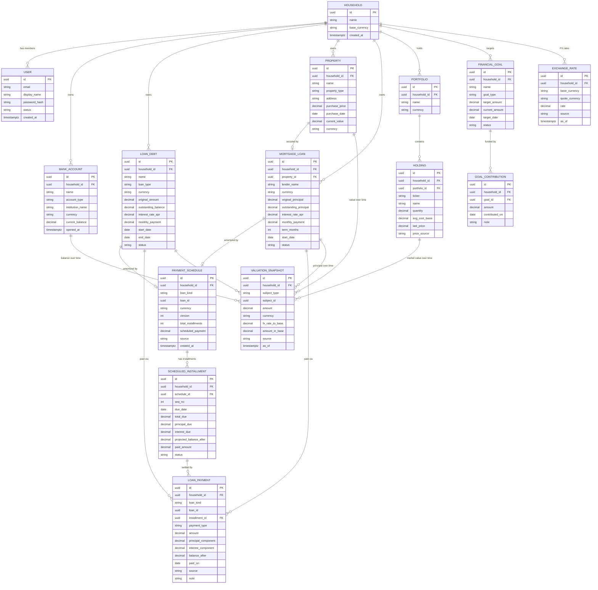
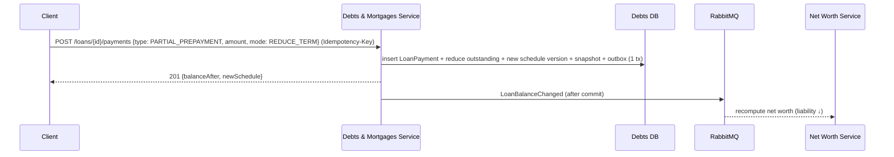

# 03 · Domain Model

This is the heart of Phase 0. All entities are **user-authored** (no external sync). Every monetary value carries a
`source` (`MANUAL` | `SEED`) and produces a **valuation snapshot** so history is reconstructable.

## 1. Entity-relationship diagram



## 2. Aggregates & invariants

| Aggregate | Root | Key invariants |
|---|---|---|
| **Household** | `Household` | Has ≥1 member; one `base_currency` (reporting currency); cannot be deleted while it owns entities |
| **ExchangeRate** | `ExchangeRate` | `rate > 0`; **append-only** — corrections insert a new row, **latest `created_at` wins** for new conversions; `base→base = 1.0` is implicit |
| **BankAccount** | `BankAccount` | `current_balance` change ⇒ new snapshot; currency immutable after creation |
| **LoanDebt** | `LoanDebt` (contains `PaymentSchedule`, `LoanPayment`) | `0 ≤ outstanding ≤ original`; `end_date > start_date`; APR ≥ 0; `outstanding = 0 ⟺ status = PAID_OFF` |
| **Property** | `Property` | `current_value ≥ 0`; revaluation ⇒ snapshot |
| **MortgageLoan** | `MortgageLoan` (contains `PaymentSchedule`, `LoanPayment`) | Optional link to one `Property`; `0 ≤ outstanding ≤ original_principal`; `outstanding = 0 ⟺ status = PAID_OFF` |
| **PaymentSchedule** | `PaymentSchedule` (contains `ScheduledInstallment`) | Belongs to exactly one loan; `Σ principal_due = original principal`; installments ordered by `seq_no`/`due_date`; **immutable once issued** — re-amortization creates a new `version` |
| **LoanPayment** | `LoanPayment` | `amount = principal_component + interest_component`; in the loan's currency; `principal_component ≤ outstanding` at payment time; reduces outstanding; raises `LoanBalanceChanged` |
| **Portfolio** | `Portfolio` (contains `Holding`) | `quantity ≥ 0`; market value = `quantity × last_price` |
| **FinancialGoal** | `FinancialGoal` (contains `GoalContribution`) | `current_amount = Σ contributions`; `0 ≤ progress ≤ 100%`; status transitions valid |

## 3. Value objects

| Value object | Shape | Rules |
|---|---|---|
| **Money** | `{ amount: decimal, currency: string }` | `decimal`/`numeric(19,4)`; currency = ISO-4217; **arithmetic only within the same currency** — cross-currency requires an explicit `Convert(rate)` |
| **ExchangeRate** | `{ base, quote, rate: decimal, asOf }` | `rate > 0`, `numeric(19,8)`; `Convert(Money m → base) = m.amount × rate` |
| **CurrencyCode** | `string` (ISO-4217) | Validated 3-letter code; uppercased |
| **Percentage** | `decimal` (0–100) | APRs, progress |
| **DateRange** | `{ start, end }` | `end > start` |
| **Ticker** | `string` | Uppercased, validated format (Phase 0: free-form symbol) |

> The `Money` type **refuses to add two different currencies** — a compile/runtime guard against the classic
> "added dollars to euros" bug. All cross-currency math goes through an explicit conversion with a dated rate.

## 4. Enumerations

```
AccountType   = CHECKING | SAVINGS | CASH | DEPOSIT | OTHER
LoanType      = PERSONAL | AUTO | STUDENT | CREDIT_LINE | OTHER
LoanStatus    = ACTIVE | PAID_OFF | CLOSED
PropertyType  = APARTMENT | HOUSE | LAND | COMMERCIAL | OTHER
ScheduleSource    = IMPORTED | GENERATED        (user-uploaded plan, or amortization computed by us)
InstallmentStatus = SCHEDULED | DUE | PAID | PARTIALLY_PAID | MISSED
PaymentType   = SCHEDULED | PARTIAL_PREPAYMENT | FULL_PAYOFF | EXTRA
              (SCHEDULED = a planned installment · PARTIAL_PREPAYMENT = early partial · FULL_PAYOFF = early full payoff · EXTRA = ad-hoc extra)
GoalType      = EMERGENCY_FUND | SAVINGS | PURCHASE | DEBT_PAYOFF | RETIREMENT | CUSTOM
GoalStatus    = ACTIVE | ON_TRACK | AT_RISK | ACHIEVED | ABANDONED
PriceSource   = MANUAL | SEED            (no live market feed in Phase 0)
ValuationSrc  = MANUAL | SEED
FxRateSource  = MANUAL | SEED            (no live FX feed in Phase 0)
UserStatus    = PENDING | ACTIVE | SUSPENDED
```

## 5. Multi-currency model

GetDue is **multi-currency from Phase 0**. The design separates three roles:

| Role | Currency | Example |
|---|---|---|
| **Native currency** | per entity | a USD checking account, a EUR apartment, a GBP mortgage |
| **Base currency** | one per household | the household reports net worth in EUR |
| **Display currency** | per request (optional) | a member temporarily views totals in USD |

**Exchange rates** are first-class data (`EXCHANGE_RATE`), owned by the **Net Worth / Aggregation service** (it is the
component that converts). In Phase 0 rates are **user-sourced or seeded** (`source = MANUAL | SEED`) — no live FX feed,
exactly like manual stock prices.

**Conversion rules**
- An amount in currency `C` converts to base via the rate effective **as of the snapshot date** (`fxRate(C→base, as_of)`).
- `base → base = 1.0` always; no rate row needed.
- The snapshot stores **both** the native `amount` (+ `currency`) **and** the `fx_rate_to_base` used **and** the
  resulting `amount_in_base` — so historical net worth is reproducible even if rates are later corrected (audit trail).
- If a required rate is **missing** for a date, aggregation flags the entity as `unconverted` rather than silently
  assuming 1.0 — surfaced to the user as "add an exchange rate".
- **Display currency** is a presentation-time second conversion (`base → display`) at the current rate; it never
  rewrites stored data.

## 6. Loan payment schedules & payments

Loans and mortgages support an **amortization (payment) schedule** plus a **payment ledger** that records real-world
payments — regular installments, **partial early prepayments**, and **full early payoff**. As with everything in
Phase 0, **no money actually moves**: a payment is a user-recorded ledger entry that updates the loan's outstanding
balance and emits a valuation snapshot. This applies identically to `LoanDebt` and `MortgageLoan` (the `loan_kind`
discriminator), and both live in the **Debts & Mortgages service**.

### 6.1 Importing / generating the schedule

A `PaymentSchedule` is the planned amortization for a loan — an ordered list of `ScheduledInstallment`s, each with its
`due_date`, `principal_due`, `interest_due`, `total_due`, and `projected_balance_after`.

| Source | How |
|---|---|
| **`IMPORTED`** | User uploads the lender's schedule as **CSV or JSON** (`POST .../schedule:import`). Rows are validated: monotonic `due_date`, `Σ principal_due` ≈ original principal (within rounding tolerance), `total_due = principal_due + interest_due`. |
| **`GENERATED`** | We compute a standard amortization from `original principal`, `interest_rate_apr`, `term_months`, `start_date` (fixed-rate, equal-installment). Useful when the user has no file. |

- The whole schedule is **validated atomically** — a bad row rejects the entire import with a per-row error report;
  nothing is partially stored.
- A schedule is **immutable once issued**. A prepayment that changes the future (see §6.3) produces a **new
  `version`** with recomputed remaining installments; prior versions are retained for audit.
- The schedule is in the **loan's native currency** (multi-currency, [§5](#5-multi-currency-model)).

### 6.2 Recording a payment (regular, partial, full)

Every payment is a `LoanPayment` with a `payment_type`, split into `principal_component` + `interest_component`
(`amount = principal + interest`):

| `payment_type` | Meaning | Effect on the loan |
|---|---|---|
| **`SCHEDULED`** | Pays a planned installment (`installment_id` set) | Marks installment `PAID` (or `PARTIALLY_PAID` if under-paid); `outstanding −= principal_component` |
| **`PARTIAL_PREPAYMENT`** | **Early partial** payment beyond/aside from the schedule | `outstanding −= principal_component`; triggers re-amortization (§6.3) |
| **`FULL_PAYOFF`** | **Early full** settlement of the entire remaining balance | `outstanding → 0`; loan `status = PAID_OFF`; all future installments `CANCELLED`; schedule closed |
| **`EXTRA`** | Ad-hoc extra payment not tied to an installment | like `PARTIAL_PREPAYMENT` |

Invariants enforced at record time:
- `principal_component ≤ current outstanding` (a `FULL_PAYOFF` sets `principal_component = outstanding`,
  `interest_component =` accrued-to-date as entered).
- Payment currency **must equal** the loan currency.
- Recording is **idempotent** via the `Idempotency-Key` ([04 §5](./04-api-design.md#5-idempotency-keys)) — a retried
  payment never double-reduces the balance.
- Each payment writes a `VALUATION_SNAPSHOT` for the loan (`amount = balance_after`) and raises `LoanBalanceChanged`.

### 6.3 Prepayment & re-amortization

A `PARTIAL_PREPAYMENT`/`EXTRA` reduces principal ahead of plan. The user chooses the re-amortization mode:

| Mode | Result |
|---|---|
| **Reduce term** (default) | Keep the installment amount; the loan finishes earlier (fewer remaining installments). |
| **Reduce installment** | Keep the end date; recompute a smaller installment over the remaining term. |

Either way the service issues a **new schedule `version`** for the *remaining* installments, recomputed from the new
outstanding balance and APR. History (old version + the payment) is preserved for audit.



### 6.4 Payoff

A `FULL_PAYOFF` zeroes the outstanding balance, sets the loan `status = PAID_OFF`, cancels remaining installments, and
emits a final snapshot of `0`. The loan then drops out of the liabilities side of net worth automatically (its latest
snapshot is `0`), and the Goals service can mark a linked `DEBT_PAYOFF` goal `ACHIEVED`.

## 7. The valuation-snapshot pattern

Rather than full event sourcing, Phase 0 uses a **lightweight append-only valuation log**:

- Any time an entity's monetary value changes (balance, property value, holding price, loan payoff), the app writes a
  row to `VALUATION_SNAPSHOT` with `subject_type`, `subject_id`, native `amount` + `currency`, the `fx_rate_to_base`
  and `amount_in_base` applied, `as_of`, and `source`.
- **Net worth at any date `D`** (in base currency) = for each subject, take its latest snapshot with `as_of ≤ D`, use
  its `amount_in_base`, sign it (asset `+`, liability `−`), sum.
- This powers: net-worth trend chart, goal progress trend, and the financial-health monitoring in [05](./05-monitoring.md).

```sql
-- Net worth (in household base currency) as of a given date — conceptual
WITH latest AS (
  SELECT DISTINCT ON (subject_type, subject_id)
         subject_type, subject_id, amount_in_base
  FROM valuation_snapshot
  WHERE as_of <= :as_of_date AND household_id = :hh
  ORDER BY subject_type, subject_id, as_of DESC
)
SELECT
  SUM(CASE WHEN subject_type IN ('BANK_ACCOUNT','PROPERTY','HOLDING') THEN amount_in_base ELSE 0 END) -
  SUM(CASE WHEN subject_type IN ('LOAN_DEBT','MORTGAGE_LOAN')        THEN amount_in_base ELSE 0 END)
  AS net_worth_base
FROM latest;
```

> `amount_in_base` is computed **at write time** from the native amount and the effective rate, so the hot
> net-worth query stays a simple sum and never joins the rate table. **Existing snapshots are immutable** — a later
> FX-rate correction does not rewrite history; only snapshots written after the correction use the new rate. This
> preserves the audit trail of §5.

## 8. Domain events (Phase 0)

| Event | Raised when | Consumed by |
|---|---|---|
| `BankAccountBalanceChanged` | balance edited | NetWorth projector |
| `PropertyRevalued` | property value edited | NetWorth projector |
| `LoanScheduleImported` | payment schedule imported/generated (new version) | monitoring (upcoming-due reminders) |
| `LoanPaymentRecorded` | a payment is recorded (scheduled/partial/full/extra) | NetWorth projector, Goals (debt-payoff), monitoring |
| `LoanBalanceChanged` | outstanding changes (payment, prepayment, payoff) | NetWorth projector, Goals (debt-payoff) |
| `LoanPaidOff` | full payoff → `status = PAID_OFF` | NetWorth projector, Goals (mark `ACHIEVED`), monitoring |
| `HoldingPriced` | holding price/qty edited | NetWorth projector |
| `ExchangeRateChanged` | FX rate added/edited | NetWorth projector (invalidate latest-rate cache; existing snapshots unchanged), monitoring |
| `GoalContributed` | contribution added | Goal progress, monitoring (on/off-track) |
| `GoalStatusChanged` | progress crosses threshold/date | Notifications, monitoring |

All events flow through the **transactional outbox** (see [01 §5](./01-architecture.md#5-cross-service-event-flow-example-user-updates-a-property-value)).

## 9. Data dictionary (selected, money fields)

| Field | Type (PG) | Notes |
|---|---|---|
| `*.amount`, `*_balance`, `*_value`, `*_principal` | `numeric(19,4)` | Never float |
| `*.currency` | `char(3)` | ISO-4217; entity's **native** currency |
| `exchange_rate.rate`, `valuation_snapshot.fx_rate_to_base` | `numeric(19,8)` | FX rates need more precision than money |
| `valuation_snapshot.amount_in_base` | `numeric(19,4)` | native `amount × fx_rate_to_base`, computed at write time |
| `household.base_currency` | `char(3)` | ISO-4217; the household reporting currency |
| `interest_rate_apr` | `numeric(6,4)` | e.g. `0.0599` = 5.99% (store as rate or %; pick one and document) |
| `loan_payment.{amount,principal_component,interest_component,balance_after}` | `numeric(19,4)` | `amount = principal + interest`; in the loan's currency |
| `scheduled_installment.{total_due,principal_due,interest_due,projected_balance_after,paid_amount}` | `numeric(19,4)` | `total_due = principal_due + interest_due` |
| `payment_schedule.version` | `int` | re-amortization issues a new version; prior versions retained |
| `*.{loan_kind}` | `text` | discriminator: `LOAN_DEBT` \| `MORTGAGE_LOAN` |
| `due_date`, `paid_on` | `date` | calendar dates (no time component) |
| `as_of`, `created_at` | `timestamptz` | UTC always |
| all `id` | `uuid` | v7 (time-ordered) preferred for index locality |

## 10. Multi-tenancy & ownership

- **Tenant = Household.** Every business row carries `household_id`.
- Every query is filtered by the caller's household via a global EF Core query filter — **no cross-household reads**.
- A `User` may belong to one household in Phase 0 (multi-household membership is Phase 1).
