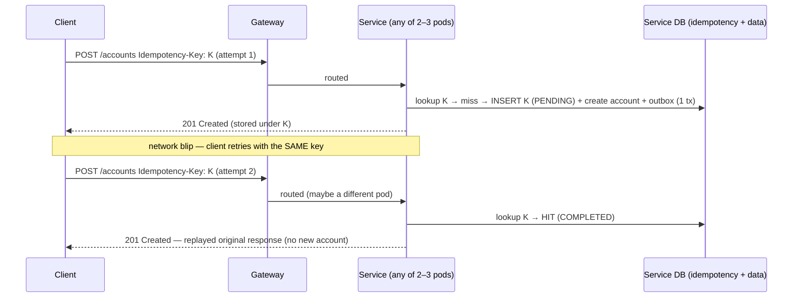
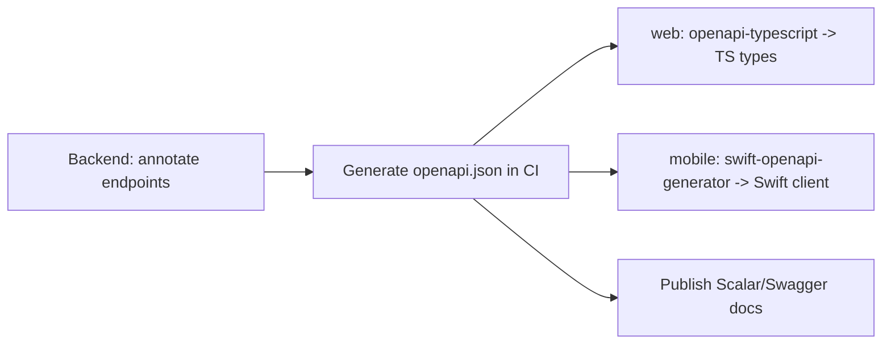

# 04 · API Design

A **YARP API gateway** presents one unified REST surface to the web cabinet and the iPhone app, routing each path to
the owning microservice (`/accounts` → Accounts service, `/goals` → Goals service, etc.). Clients see a single
contract and never address services directly. Each service publishes its own OpenAPI fragment; the gateway aggregates
them into one document that is the **source of truth** — both clients generate types from it (`openapi-typescript`
for web, `swift-openapi-generator` for the SwiftUI app).

## 1. Conventions

| Topic | Convention |
|---|---|
| Base URL | `https://api.getdue.com/v1` |
| Format | JSON; UTF-8; `camelCase` fields |
| Auth | `Authorization: Bearer <access_jwt>`; refresh via HTTP-only cookie |
| IDs | UUID (v7) strings |
| Money | `{ "amount": "1234.56", "currency": "EUR" }` — amount as **string** to avoid float loss |
| Dates | ISO-8601; timestamps in UTC (`Z`) |
| Pagination | `?page=1&pageSize=20` → `{ items, page, pageSize, total }` |
| Errors | RFC 9457 Problem Details (`application/problem+json`) |
| Idempotency | `Idempotency-Key` header **required** on all creating/state-changing POSTs — see [§5](#5-idempotency-keys) |
| Versioning | URL-path major `/v1`; additive changes stay in-place — full rules in [11 · Versioning](./11-versioning.md#2-api-versioning) |
| Correlation | `traceparent` (W3C) propagated; echoed `X-Request-Id` |

## 2. Resource map

```
POST   /v1/auth/register
POST   /v1/auth/login
POST   /v1/auth/refresh
POST   /v1/auth/logout
GET    /v1/me
GET    /v1/me/export                       # GDPR access/portability: full JSON dump of the caller's household ([09 SEC-DATA-07](./09-security-standard.md#10-data-protection))
DELETE /v1/me                              # GDPR erasure: soft-delete + erasure SLA per 09 SEC-DATA-07

GET    /v1/household
PATCH  /v1/household                      # name, base currency

# Bank accounts
GET    /v1/accounts
POST   /v1/accounts
GET    /v1/accounts/{id}
PATCH  /v1/accounts/{id}
DELETE /v1/accounts/{id}
PUT    /v1/accounts/{id}/balance          # records a new balance snapshot

# Loan debts
GET    /v1/loans
POST   /v1/loans
GET    /v1/loans/{id}
PATCH  /v1/loans/{id}
DELETE /v1/loans/{id}
POST   /v1/loans/{id}/schedule:import     # import amortization schedule (CSV/JSON)
POST   /v1/loans/{id}/schedule:generate   # generate a standard amortization schedule
GET    /v1/loans/{id}/schedule            # current schedule (?version= for a past version)
GET    /v1/loans/{id}/payments            # payment ledger
POST   /v1/loans/{id}/payments            # record payment: SCHEDULED | PARTIAL_PREPAYMENT | FULL_PAYOFF | EXTRA
POST   /v1/loans/{id}/payoff              # convenience: full early payoff (= FULL_PAYOFF)

# Real estate
GET    /v1/properties
POST   /v1/properties
GET    /v1/properties/{id}
PATCH  /v1/properties/{id}
DELETE /v1/properties/{id}
PUT    /v1/properties/{id}/valuation      # records a new value snapshot

# Mortgages (same schedule + payment sub-resources as loans)
GET    /v1/mortgages
POST   /v1/mortgages                       # optionally links a propertyId
GET    /v1/mortgages/{id}
PATCH  /v1/mortgages/{id}
DELETE /v1/mortgages/{id}
POST   /v1/mortgages/{id}/schedule:import
POST   /v1/mortgages/{id}/schedule:generate
GET    /v1/mortgages/{id}/schedule
GET    /v1/mortgages/{id}/payments
POST   /v1/mortgages/{id}/payments
POST   /v1/mortgages/{id}/payoff

# Stocks
GET    /v1/portfolios
POST   /v1/portfolios
GET    /v1/portfolios/{id}
POST   /v1/portfolios/{id}/holdings
PATCH  /v1/holdings/{id}                    # qty, price, cost basis
DELETE /v1/holdings/{id}

# Goals
GET    /v1/goals
POST   /v1/goals
GET    /v1/goals/{id}
PATCH  /v1/goals/{id}
DELETE /v1/goals/{id}
POST   /v1/goals/{id}/contributions

# Exchange rates (multi-currency; user-sourced in Phase 0; append-only — corrections insert a new row)
GET    /v1/fx-rates                         # rates known to this household (latest per (base, quote, asOf))
POST   /v1/fx-rates                         # append a rate row {base, quote, rate, asOf} — corrections add a new row
GET    /v1/fx-rates/missing                 # currencies in use that lack a rate to base

# Aggregation (multi-currency: ?displayCurrency overrides the base for presentation)
GET    /v1/networth?displayCurrency=USD     # current net worth + asset/liability + per-currency breakdown
GET    /v1/networth/history?from&to&grain&displayCurrency  # trend series for charts

# Client dashboard & analytics (read models; see doc 10)
GET    /v1/dashboard?displayCurrency=USD    # one call: all dashboard widgets for the home screen
GET    /v1/analytics/allocation             # asset allocation by class & by currency
GET    /v1/analytics/liabilities            # debt breakdown, total debt, weighted avg APR, payoff progress
GET    /v1/analytics/goals                   # aggregate goal progress (on/at-risk/achieved counts)
GET    /v1/analytics/currency-exposure       # % of net worth per native currency
GET    /v1/analytics/movements?from&to       # what changed net worth between two dates (per entity)
GET    /v1/analytics/kpis                     # debt-to-asset, liquidity, leverage, MoM change

# Monitoring (read-only, user-facing health)
GET    /health                             # liveness (ops, unversioned; matches K8s probes in 01 §7)
GET    /health/ready                       # readiness (ops, unversioned)
GET    /v1/insights                        # financial-health signals for this household
```

## 3. Sample payloads

### Create a bank account
```http
POST /v1/accounts
Authorization: Bearer eyJ...
Idempotency-Key: 0f6c...

{
  "name": "Main Checking",
  "accountType": "CHECKING",
  "institutionName": "My Bank (manual)",
  "currentBalance": { "amount": "5230.00", "currency": "EUR" },
  "openedAt": "2021-03-01"
}
```
```http
201 Created
Location: /v1/accounts/018f...

{
  "id": "018f...",
  "name": "Main Checking",
  "accountType": "CHECKING",
  "currency": "EUR",
  "currentBalance": { "amount": "5230.00", "currency": "EUR" },
  "createdAt": "2026-06-13T10:00:00Z"
}
```

### Net worth response (multi-currency)

Every multi-currency response carries both `baseCurrency` (the household reporting currency) and `displayCurrency`
(equal to base unless `?displayCurrency` overrides it). All totals are expressed in `displayCurrency`; `byCurrency`
shows the native-currency composition, and `unconverted` flags anything missing an FX rate.

```http
GET /v1/networth?displayCurrency=EUR
```
```json
{
  "asOf": "2026-06-13T10:00:00Z",
  "baseCurrency": "EUR",
  "displayCurrency": "EUR",
  "netWorth": "312450.0000",
  "assets": {
    "total": "498000.0000",
    "byClass": {
      "bankAccounts": "23450.0000",
      "realEstate": "420000.0000",
      "stocks": "54550.0000"
    }
  },
  "liabilities": {
    "total": "185550.0000",
    "byClass": { "loans": "12550.0000", "mortgages": "173000.0000" }
  },
  "byCurrency": [
    { "currency": "EUR", "netNative": "249995.3000", "fxRateToDisplay": "1.00000000", "netInDisplay": "249995.3000" },
    { "currency": "USD", "netNative": "68000.0000",  "fxRateToDisplay": "0.92000000", "netInDisplay": "62560.0000" },
    { "currency": "GBP", "netNative": "-90.0000",    "fxRateToDisplay": "1.17000000", "netInDisplay": "-105.3000" }
  ],
  "ratesAsOf": "2026-06-13",
  "unconverted": []
}
```

If a rate is missing, the entity's value is excluded from `netWorth` and listed under `unconverted` so the UI can
prompt the user to add the rate:
```json
{
  "unconverted": [
    { "currency": "CHF", "subjectType": "BANK_ACCOUNT", "amount": "4000.0000", "reason": "no CHF→EUR rate" }
  ]
}
```

### Net worth history (for the trend chart)
```http
GET /v1/networth/history?from=2025-01-01&to=2026-06-13&grain=month&displayCurrency=EUR
```
```json
{
  "baseCurrency": "EUR",
  "displayCurrency": "EUR",
  "grain": "month",
  "series": [
    { "asOf": "2025-01-31", "netWorth": "280100.0000" },
    { "asOf": "2025-02-28", "netWorth": "284300.0000" }
  ]
}
```

### Append an exchange rate
```http
POST /v1/fx-rates
Idempotency-Key: 7c1a...

{ "base": "EUR", "quote": "USD", "rate": "1.08695652", "asOf": "2026-06-13" }
```
The household reads "1 EUR = 1.08695652 USD" (`rate = quote_per_base`, see [03 §3](./03-domain-model.md#3-value-objects)); the inverse
(`USD→EUR = 1 / rate`) is derived. Rates are **append-only** — editing or correcting a rate inserts a new row with a
fresh server-stamped `createdAt`; the latest `createdAt` for the same `(base, quote, asOf)` wins for new conversions.
Existing valuation snapshots retain the `fx_rate_to_base` they were written with, preserving the audit trail.
`ExchangeRateChanged` invalidates the latest-rate cache so subsequent writes pick up the correction. `source` and
`createdAt` are **server-set** — request bodies that include them are rejected (`422`).

### Create a financial goal
```http
POST /v1/goals

{
  "name": "Emergency Fund",
  "goalType": "EMERGENCY_FUND",
  "targetAmount": { "amount": "50000.00", "currency": "EUR" },
  "targetDate": "2027-12-31"
}
```
```json
{
  "id": "018f...",
  "name": "Emergency Fund",
  "targetAmount": { "amount": "50000.00", "currency": "EUR" },
  "currentAmount": { "amount": "0.00", "currency": "EUR" },
  "progressPct": 0,
  "status": "ACTIVE",
  "targetDate": "2027-12-31",
  "projection": {
    "onTrack": false,
    "requiredMonthly": { "amount": "2702.70", "currency": "EUR" },
    "projectedCompletionDate": "2028-08-31"
  }
}
```

### Import a loan payment schedule
```http
POST /v1/loans/018f.../schedule:import
Idempotency-Key: a1b2...

{
  "currency": "EUR",
  "installments": [
    { "seqNo": 1, "dueDate": "2026-07-01", "totalDue": "450.00", "principalDue": "300.00", "interestDue": "150.00", "projectedBalanceAfter": "29700.00" },
    { "seqNo": 2, "dueDate": "2026-08-01", "totalDue": "450.00", "principalDue": "301.50", "interestDue": "148.50", "projectedBalanceAfter": "29398.50" }
  ]
}
```
```http
201 Created
{ "scheduleId": "018f...", "version": 1, "source": "IMPORTED", "totalInstallments": 2, "currency": "EUR" }
```
Validation rejects the **whole** file (no partial import) with a per-row report if dates aren't monotonic,
`totalDue ≠ principalDue + interestDue`, or `Σ principalDue` is outside rounding tolerance of the original principal.
Alternatively `POST .../schedule:generate { "mode": "EQUAL_INSTALLMENT" }` computes the schedule from the loan's
principal, APR, term, and start date.

### Record a partial early prepayment (re-amortize)
```http
POST /v1/loans/018f.../payments
Idempotency-Key: 9c2e...

{
  "paymentType": "PARTIAL_PREPAYMENT",
  "amount": { "amount": "5000.00", "currency": "EUR" },
  "principalComponent": { "amount": "5000.00", "currency": "EUR" },
  "interestComponent": { "amount": "0.00", "currency": "EUR" },
  "paidOn": "2026-09-15",
  "reamortize": "REDUCE_TERM"
}
```
```json
{
  "paymentId": "018f...",
  "paymentType": "PARTIAL_PREPAYMENT",
  "balanceAfter": { "amount": "24398.50", "currency": "EUR" },
  "schedule": { "version": 2, "remainingInstallments": 64, "scheduledPayment": { "amount": "450.00", "currency": "EUR" } }
}
```
`reamortize` ∈ `REDUCE_TERM` (keep installment, finish sooner — default) | `REDUCE_INSTALLMENT` (keep end date,
smaller installment). A new schedule **version** is issued; the prior version is retained for audit.

### Full early payoff
```http
POST /v1/loans/018f.../payoff
Idempotency-Key: 4d8a...

{ "paidOn": "2026-09-15", "interestComponent": { "amount": "120.00", "currency": "EUR" } }
```
```json
{
  "paymentId": "018f...",
  "paymentType": "FULL_PAYOFF",
  "balanceAfter": { "amount": "0.00", "currency": "EUR" },
  "loanStatus": "PAID_OFF"
}
```
The server sets `principalComponent = outstanding`, zeroes the balance, cancels remaining installments, and emits
`LoanPaidOff` — net worth drops the liability and a linked `DEBT_PAYOFF` goal can flip to `ACHIEVED`.

> **Currency rule:** payment amounts MUST be in the loan's currency. **Idempotency** ([§5](#5-idempotency-keys)) makes
> a retried payment safe — it never double-reduces the balance.

## 4. Error shape (RFC 9457)

```json
{
  "type": "https://getdue.com/errors/validation",
  "title": "Validation failed",
  "status": 422,
  "detail": "outstandingBalance must not exceed originalAmount",
  "instance": "/v1/loans",
  "errors": {
    "outstandingBalance": ["must be <= originalAmount"]
  },
  "traceId": "00-4bf92f...-01"
}
```

| Status | Used for |
|---|---|
| 400 | Malformed request |
| 401 / 403 | Unauthenticated / not your household |
| 404 | Unknown resource |
| 409 | Conflict (e.g., duplicate idempotency key, version conflict) |
| 422 | Domain/validation rule violated |
| 429 | Rate limited |
| 5xx | Server fault (traced + alerted) |

## 5. Idempotency keys

A retry must never create a second bank account, double-record a loan payment, or double-fund a goal. Because every
service runs **2–3 stateless pods** behind a load balancer, a client retry can land on a *different* pod than the
original — so idempotency is enforced in **shared storage**, not pod memory.

### Rules

- **Required** on every state-changing request that records a new fact or appends a snapshot: all `POST` creates and
  the snapshot/event-producing actions (`POST .../payments`, `POST .../contributions`, `PUT /accounts/{id}/balance`,
  `PUT /properties/{id}/valuation`, `POST /fx-rates`). `GET` and `DELETE` are naturally idempotent and don't require
  a key.
- The **client generates** the key — a UUID (v4/v7) — and sends it in the `Idempotency-Key` header. The client
  **reuses the same key for all retries** of the same logical operation.
- **Scope** of a key = `(householdId, userId, method, route-template, Idempotency-Key)`. The same key under a
  different user/endpoint is a different operation.
- The server stores `key → { requestFingerprint, status, responseBody, createdAt }` with a **7d TTL** (configurable;
  24h is too short for mobile clients that retry from background after airplane mode or app suspension).
- **Replay:** a repeated key whose request body matches returns the **stored original response verbatim**, including
  the original status code and `Location` — the side effect happens **exactly once**.
- **Conflict:** a repeated key with a **different** request body → **`409 Conflict`** (`type: .../idempotency-key-reuse`).
- **In-flight:** if the first request is still processing when a retry arrives, the retry gets **`409`** (or `425 Too
  Early`) and a `Retry-After` hint — never a parallel second execution.

### Storage

| Option | When | Note |
|---|---|---|
| **Service's own Postgres** (recommended) | the create + the idempotency record commit in **one transaction** | strongest guarantee — record and side effect are atomic; survives Redis loss |
| **Redis** (with TTL) | high-volume, non-critical creates | faster, but needs care so the record and the write can't diverge |

> For money-touching writes, prefer the **Postgres** path so the idempotency row and the domain change are written in
> the **same transaction** as the outbox event ([01 §5](./01-architecture.md#5-cross-service-event-flow-example-user-updates-a-property-value)) —
> one atomic unit: *side effect + idempotency record + published event*.

### Flow



### Request/response example

```http
POST /v1/loans/018f.../payments
Idempotency-Key: 9b2e6c1a-0e2f-4f6a-bb3d-7c9a1e4d8a55

{
  "paymentType": "SCHEDULED",
  "installmentId": "018f-aaaa-...",
  "amount":             { "amount": "350.00", "currency": "EUR" },
  "principalComponent": { "amount": "320.00", "currency": "EUR" },
  "interestComponent":  { "amount":  "30.00", "currency": "EUR" },
  "paidOn": "2026-06-13"
}
```

A duplicate key with a changed body:
```json
{
  "type": "https://getdue.com/errors/idempotency-key-reuse",
  "title": "Idempotency key reused with a different payload",
  "status": 409,
  "detail": "Key 9b2e6c1a... was already used for a different request.",
  "traceId": "00-4bf92f...-01"
}
```

### Relationship to event idempotency

Two layers, both required:
- **API idempotency** (this section) — protects against duplicate *client* requests (`Idempotency-Key`).
- **Consumer idempotency** — event consumers (Net Worth, Insights) **dedupe by event id**, so the broker's
  at-least-once delivery can't double-apply an event ([01 §6](./01-architecture.md#6-statelessness--scaling-model),
  [09 SEC-RES-03](./09-security-standard.md#11-resilience--abuse-prevention)).

This is centralized as middleware in `getdue-buildingblocks` ([08](./08-repositories.md)) so every service behaves
identically.

## 6. Security headers & limits

- TLS 1.2+ only; HSTS.
- Per-user + per-IP **rate limits** (ASP.NET Core rate limiter; counters in Redis).
- Request size caps; strict JSON binding; reject unknown fields on writes.
- CORS allow-list: web origin only (mobile uses native, not CORS-bound).

## 7. Contract-first workflow



The OpenAPI doc is generated and **committed/published on every merge**, so client teams never hand-write types.
