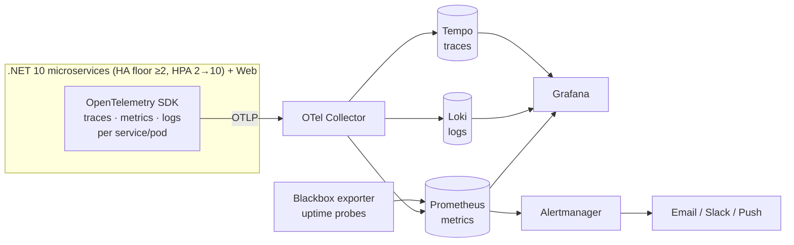
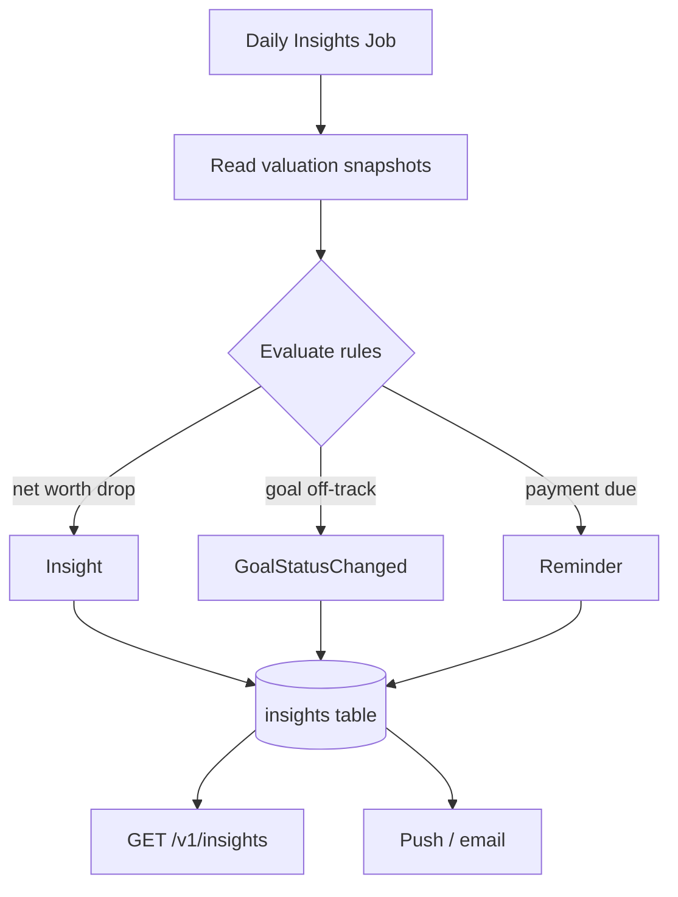

# 05 · Monitoring System

The monitoring system is a **first-class Phase 0 deliverable**, not an afterthought. It has **two faces**:

1. **Operational monitoring** — for you, the operator: is it up, fast, correct?
2. **Financial-health monitoring** — for the user: is *their* money on track?

Both are powered by the same telemetry pipeline (OpenTelemetry → Prometheus/Loki/Tempo → Grafana).

## 1. Telemetry pipeline

- **One instrumentation API:** OpenTelemetry. Backends are swappable without code changes (ADR-005).
- **Correlation:** every log line and metric exemplar carries the active `traceId`, so a Grafana panel jumps
  log → trace → metric in one click.

## 2. The three pillars

### Metrics (Prometheus)
| Category | Example metrics |
|---|---|
| **RED (per endpoint)** | `http_server_request_duration_seconds` (Rate, Errors, Duration) |
| **Runtime** | GC pauses, heap, thread pool, CPU, working set |
| **EF Core / DB** | query duration, active connections, pool saturation (per-service DB) |
| **Outbox** | pending events, dispatch lag, retries, dead-letter count |
| **Broker (RabbitMQ)** | queue depth, consumer lag, unacked messages, publish/consume rate, DLQ size |
| **Per-service / per-pod** | ready replicas vs desired (HA floor ≥2, HPA scales 2→10; ceiling is a Phase-0 cost cap, not a fixed limit), pod restarts, readiness flaps |
| **Business** | net-worth recompute count, goals created, snapshots written |
| **Projection drift** | net-worth/dashboard projection drift vs source valuation snapshots, recompute lag, reconcile/rebuild job runs (see [§5](#5-financial-health-monitoring-the-product-facing-half)) |

> All RED/runtime metrics are labeled by `service` and `pod`, so dashboards break down per microservice and per
> replica — essential for spotting one unhealthy pod among the ≥2 (HA floor) behind a service.

### Logs (Serilog → Loki)
- Structured JSON, one event per line, with `traceId`, `householdId` (hashed), `userId` (hashed), `requestId`.
- Levels: `Information` (business events), `Warning` (recoverable), `Error` (faults). **No PII or money values in logs.**

### Traces (Tempo)
- End-to-end spans: HTTP → handler → EF query → outbox dispatch → projector.
- Used to debug latency and to prove the valuation/net-worth flow executed correctly.

## 3. Health checks

| Endpoint | Checks | Used by |
|---|---|---|
| `GET /health` | process alive | Container liveness probe (unversioned — matches K8s YAML in [01 §7](./01-architecture.md#7-deployment-architecture-kubernetes)) |
| `GET /health/ready` | Postgres reachable, Redis reachable, migrations applied, outbox drainable | Load balancer / readiness probe (unversioned) |

Implemented with **ASP.NET Core HealthChecks** (`AddNpgSql`, `AddRedis`, custom outbox check).

## 4. Operational dashboards (Grafana)

| Dashboard | Panels |
|---|---|
| **Service Overview** | RPS, error rate, p50/p95/p99 latency, saturation (USE), uptime % |
| **API Detail** | per-endpoint RED, top slow endpoints, status-code heatmap |
| **Data Layer** | DB query latency, connection pool, slow queries, deadlocks |
| **Async / Outbox** | pending backlog, dispatch lag, retry/DLQ counts |
| **Runtime** | GC, memory, CPU, thread pool by pod |

## 5. Financial-health monitoring (the product-facing half)

This is what makes a *home bank* monitoring system, not just an ops dashboard. It watches the user's **data**, not
the servers, and surfaces via `GET /v1/insights` + push notifications.

| Signal | Rule (example) | Surfaced as |
|---|---|---|
| **Net-worth drop** | net worth ↓ > X% month-over-month | Insight + push |
| **Goal off-track** | projected completion date > target date | Goal status `AT_RISK` |
| **Goal achieved** | `current ≥ target` | Status `ACHIEVED` + celebration |
| **Mortgage/loan due** | next `SCHEDULED_INSTALLMENT.due_date` within N days, still unpaid | Reminder push |
| **Loan paid off** | `LoanPaidOff` (full early payoff) | Celebration + net-worth update |
| **High leverage** | total liabilities / total assets > threshold | Insight |
| **Stale data** | an entity not updated in > 90 days | "Update your balances" nudge |
| **Concentration risk** | one holding > X% of portfolio | Insight |

These are computed by a **scheduled hosted service** that reads the valuation snapshots and emits
`Insight` / `GoalStatusChanged` events. Thresholds are configuration, tunable per household later.

**Projection-drift monitoring.** Net-worth and dashboard widgets are **eventually-consistent projections** rebuilt
from valuation snapshots ([10 §5](./10-dashboard-analytics.md#5-performance--freshness)). A dedicated metric/alert
watches **projection drift** — the difference between the live projection and a recompute from the source snapshots —
so a stale or diverged read model is caught rather than silently served. An **idempotent reconcile/rebuild job**
rebuilds projections from the snapshot history (replayable on demand or on drift); its runs and outcomes are
themselves metered (see the **Projection drift** row in [§2](#2-the-three-pillars)).

## 6. Alerting (Alertmanager + Grafana alerts)

The table below is the **Target operating model (team)**: full on-call/IR with a pager for Critical alerts.

| Severity | Example condition | Route |
|---|---|---|
| **Critical (page)** | error rate > 5% for 5m; readiness failing; DB down; service below 2 healthy pods (HA floor); projection drift over threshold | Operator — immediate |
| **Warning** | p95 latency > 1s for 10m; outbox/broker backlog > N; consumer lag rising; disk > 80% | Operator — batched |
| **Info** | deploy completed; nightly job finished | Channel log |
| **User-facing** | goal at-risk, payment due, goal achieved | End user — push/email |

> **Solo-phase (now).** With a single responder there is **no 24/7 paging**: Critical alerts route **asynchronously**
> (email/Slack) for best-effort response, not to a pager. The conditions are unchanged — in particular the
> **below 2 healthy pods** condition stays as an **HA floor** signal. The pager/on-call rotation is part of the
> **Target operating model (team)** above.

Every alert links to a **runbook** entry (`docs/runbooks/`) describing diagnosis + remediation.

## 7. SLOs (Phase 0 targets)

| SLO | Target |
|---|---|
| API availability | 99.5% monthly |
| Read latency (p95) | < 300 ms |
| Write latency (p95) | < 600 ms |
| Net-worth recompute lag | < 5 s after an edit |
| Error budget | 0.5% / month, burn-rate alerted |

> In **solo-phase (now)** these are **best-effort targets** (single responder, asynchronous alerts); the full
> SLA-backed on-call commitment is part of the **Target operating model (team)**.

## 8. Local & cloud parity

- **Local:** `ops/docker-compose.yml` brings up Postgres, Redis, OTel Collector, Prometheus, Grafana, Loki, Tempo —
  the *same* dashboards run on a laptop as in prod.
- **Cloud:** the Grafana stack runs alongside the app (or use **Azure Managed Grafana** + **Azure Monitor** if you
  prefer managed). The instrumentation code is identical either way.

## 9. Data privacy in telemetry

- Logs/metrics/traces carry **hashed** identifiers, never raw email/name.
- **No monetary amounts** in telemetry — only counts/durations and ratios. (Net-worth *values* live in the DB and
  are shown only to the authenticated owner via the API.)
- Telemetry retention: traces 7d, logs 30d, metrics 13mo (tunable).

## 10. Disaster Recovery (RTO/RPO)

Phase 0 runs in a **single region** — this is a **risk explicitly accepted** for Phase 0 (consistent with the 99.5%
availability SLO in [§7](#7-slos-phase-0-targets) and the risk register in
[07 §5](./07-roadmap.md#5-risks--mitigations)). Multi-AZ / multi-region is **Target / Phase 1**.

| Target | Value | Mechanism |
|---|---|---|
| **RTO** | **4 h** | Restore from automated backups into a rebuilt cluster |
| **RPO** | **≤ 15 min** | **Postgres PITR** (point-in-time recovery) — per-service databases |
| **Redis** | no RPO target | Cache + refresh tokens only — **rebuildable on loss**, not a source of truth |
| **RabbitMQ** | no message loss | **Durable queues** + the **transactional outbox**: undelivered events replay from the outbox after recovery |
| **Validation** | every quarter | **Quarterly backup/restore drill**, documented (gates M7, [07 §1](./07-roadmap.md#1-phase-0-milestones)) |

- **Postgres** is the system of record; PITR gives an RPO of ≤15 min and lets net worth be reconstructed for any
  historical date. Backups are restored into a freshly provisioned cluster to meet the 4 h RTO.
- **Redis** holds only cache entries and refresh tokens; on loss it is repopulated from the read models / re-issued
  on next login, so it needs no backup.
- **RabbitMQ** uses durable queues; combined with the **outbox** every domain event is persisted in its owning
  service's DB first, so in-flight messages are **replayable** after a failover — no event is lost.
- After a restore, the **idempotent projection reconcile/rebuild job** ([§5](#5-financial-health-monitoring-the-product-facing-half))
  rebuilds net-worth/dashboard projections from the recovered valuation snapshots, and **projection-drift monitoring**
  confirms the read models match the source data.
- **Solo-phase (now):** the drill and any recovery are best-effort, single-responder; a full IR runbook with SLA is
  part of the **Target operating model (team)** ([§6](#6-alerting-alertmanager--grafana-alerts)).
