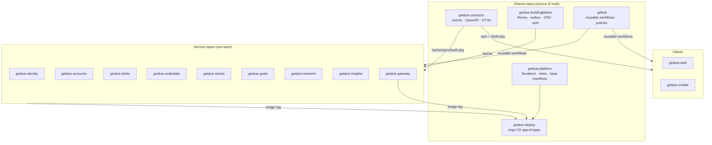
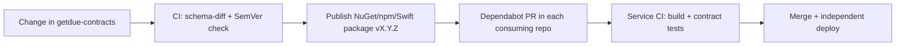

# 08 · Repositories & Contracts (Multi-Repo Strategy)

GetDue uses a **polyrepo** model: **one GitHub repository per microservice**, plus a small set of **shared repos**
that distribute contracts and common libraries as **versioned packages**. This gives each service independent
delivery, isolated access control, and a blast radius of one — properties a bank-grade platform requires.

## 1. Repository map



## 2. Repository inventory

| Repo | Type | Owner team | Publishes |
|---|---|---|---|
| `getdue-identity` … `getdue-insights` (8) | Service | service team | container image |
| `getdue-gateway` | Edge | platform | container image |
| `getdue-web` | Client | web | container image |
| `getdue-mobile` | Client | mobile | App Store build |
| `getdue-contracts` | Shared | architecture | NuGet `GetDue.Contracts.*`, npm `@getdue/contracts`, `GetDueContracts` Swift package |
| `getdue-buildingblocks` | Shared | platform | NuGet `GetDue.BuildingBlocks.*` |
| `getdue-platform` | Infra | platform/SRE | Helm charts, Terraform modules (tagged) |
| `getdue-deploy` | GitOps | platform/SRE | — (declarative state) |
| `.github` | Org config | security/platform | reusable workflows, org rulesets |

## 3. The contracts repo (`getdue-contracts`)

The single **source of truth** for everything that crosses a service boundary:

- **Integration events** — message schemas for the broker (`PropertyValued`, `GoalContributed`, `BalanceChanged`, …),
  versioned and backward-compatible.
- **OpenAPI specs** — each service's public API fragment; the gateway aggregates them.
- **Shared DTOs / enums** — `Money`, `Currency`, enum definitions used in payloads.

**Distribution (multi-language, since clients are TS + Swift):**

| Consumer | Package | Generated via |
|---|---|---|
| C# services | NuGet `GetDue.Contracts` | source-gen from schema |
| Next.js web | npm `@getdue/contracts` + `openapi-typescript` | CI codegen |
| SwiftUI mobile | Swift package + `swift-openapi-generator` | CI codegen |

**Rules:**
- Contracts are **versioned with SemVer**; a **breaking change requires a major bump** and an ADR.
- Backward compatibility is **CI-enforced** (schema-diff gate) — additive changes only within a major version.
- A service may **only** depend on a **published, tagged** contracts version — never a branch or a local path.
- Event schemas carry an explicit `schemaVersion`; consumers tolerate unknown fields (tolerant reader).

## 4. Shared library repo (`getdue-buildingblocks`)

Common C# primitives so services stay consistent **without sharing domain logic**: `Money` value object,
transactional outbox + relay, **idempotency-key middleware** ([04 §5](./04-api-design.md#5-idempotency-keys)),
OpenTelemetry bootstrap, JWT auth handlers, Polly resilience policies, problem-details middleware. Published as NuGet
packages, consumed via pinned versions. **No business/domain code** lives here — that would couple services.

## 5. Versioning & dependency flow



- **SemVer everywhere**; pinned versions in each repo (no floating ranges).
- **Dependabot** opens version-bump PRs across all consuming repos automatically.
- **Consumer-driven contract tests** (Pact-style or schema validation) run in each service's CI so a contract bump
  can't silently break a consumer.

> The full cross-layer versioning rules — API majors, service/image tags, event `schemaVersion`, DB migration
> compatibility, infra/GitOps — are defined in **[11 · Versioning System](./11-versioning.md)**.

## 6. CI/CD per service repo

Each service repo runs the **same org reusable workflow** (`.github`), so the pipeline is uniform and centrally
governed:

```
build → unit + integration tests → 100% coverage gate + mutation gate (doc 12) → architecture tests →
SAST + secret scan + SCA + IaC scan + container scan →
SBOM + image sign (cosign) → publish image to registry →
bump image tag in getdue-deploy (GitOps) → Argo CD rolls out (2–3 pods)
```

## 7. Branch protection & repo security rules (all repos)

Enforced via **org-level GitHub rulesets** (so no repo can opt out):

- **Protected default branch:** no direct pushes; **PR required** with **1 approval from `CODEOWNERS`**.
- **Required status checks:** all CI gates in §6 must pass; **no merge on red**.
- **Signed commits required** (GPG/Sigstore); linear history; no force-push to default.
- **`CODEOWNERS`** mandatory; security-sensitive paths require the security team's review.
- **Secret scanning + push protection ON**; **Dependabot alerts + security updates ON**; **CodeQL** required.
- **Least-privilege access:** teams get write only to their service repo; admin is restricted; service accounts use
  short-lived tokens (OIDC to the cloud, no long-lived secrets).
- **Environments:** `staging` auto-deploy; **`production` requires manual approval** (separation of duties).
- **Tags/releases immutable**; artifacts signed and provenance-attested (SLSA).

Full control catalogue: **[09 · Security Standard](./09-security-standard.md)**.

## 8. Local development across repos

Polyrepo must not slow developers down:

- `getdue-platform` ships a **Docker Compose mesh** that pulls published service images + Postgres/Redis/RabbitMQ +
  the Grafana stack — one command to run the whole system locally.
- Working on one service? Run that service from source and the rest from images.
- A `getdue` meta CLI / workspace script clones and updates all repos in one go.

## 9. Trade-offs (recorded honestly)

| Benefit | Cost | Mitigation |
|---|---|---|
| Independent deploy/rollback, blast radius = 1 | Cross-repo coordination | contracts/buildingblocks packages + Dependabot |
| Per-repo least-privilege & branch protection | More repos to govern | org-level rulesets + `.github` reusable workflows |
| Clear ownership & separation of duties | Version-bump churn | automated PRs + consumer-driven contract tests |
| Clean audit trail per service | Harder "atomic" cross-service change | versioned, backward-compatible contracts (never break in lockstep) |
