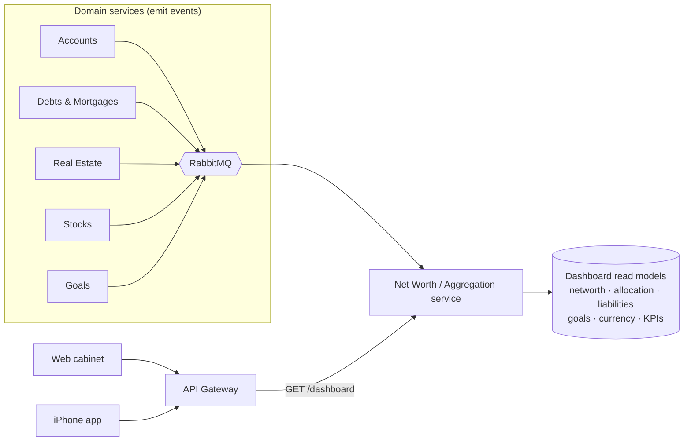

# 10 · Client Dashboard & Money Analytics

The **client dashboard** is the home screen of the personal cabinet (web) and the iPhone app: at a glance, *what am I
worth, what do I own, what do I owe, and am I on track?* It is **read-only analytics** computed from the same
valuation snapshots and events that drive net worth — no new source of truth, no money movement.

## 1. Ownership & data flow

Analytics is a **query/read-model concern**. The **Net Worth / Aggregation service** already consumes every
`*Valued` / `*BalanceChanged` / `LoanPaymentRecorded` / `GoalContributed` event and owns the `ValuationSnapshot`
history + `ExchangeRate` table — so it is the natural owner of the dashboard read models. It maintains **denormalized
projections** updated on each event, so the dashboard is a **single fast read**, not a fan-out across services.



> **Why a projection, not on-the-fly joins:** the home screen is the most-hit endpoint; precomputing widgets from
> events keeps it a single indexed read per household and avoids cross-service calls on the hot path. Phase 1 may
> split this into a dedicated **Analytics service** if reporting grows — the event-driven design makes that a lift,
> not a rewrite.

## 2. What the dashboard shows (Phase 0)

Everything below is derivable from **balances + valuations + FX + loan schedules + goals** — the data Phase 0 already
has. (Spending/income analytics need transaction history and are **Phase 1**, see [§6](#6-explicitly-deferred).)

| Widget | Content | Source |
|---|---|---|
| **Net worth** | current value (base + display currency), Δ vs last month, sparkline | net-worth read model |
| **Net-worth trend** | time series, selectable range/grain | `valuation_snapshot` history |
| **Assets vs liabilities** | totals + ratio gauge | aggregation |
| **Asset allocation** | by class (cash, real estate, stocks) and by currency | snapshots by `subject_type`/currency |
| **Liabilities breakdown** | loans vs mortgages, total debt, **weighted-avg APR**, next payment due | Debts events + schedules |
| **Debt payoff progress** | % of original principal repaid, projected payoff date | loan schedules + payments |
| **Goals overview** | aggregate progress %, counts `ON_TRACK / AT_RISK / ACHIEVED` | Goals events |
| **Currency exposure** | % of net worth held per native currency | snapshots grouped by currency |
| **Movements** | what moved net worth between two dates, per entity (waterfall) | snapshot deltas |
| **KPIs** | debt-to-asset, liquidity ratio, leverage, MoM net-worth change | derived |

### KPI definitions (Phase 0)

| KPI | Formula |
|---|---|
| **Net worth** | `Σ assets_in_base − Σ liabilities_in_base` |
| **Debt-to-asset** | `Σ liabilities / Σ assets` |
| **Leverage** | `Σ assets / net worth` |
| **Liquidity ratio** | `liquid assets (cash + bank) / Σ liabilities` |
| **Weighted-avg APR** | `Σ(outstanding_i × apr_i) / Σ outstanding_i` over loans+mortgages |
| **MoM change** | `(net_worth_now − net_worth_30d_ago) / net_worth_30d_ago` |
| **Debt payoff %** | `1 − outstanding / original` per loan; aggregate weighted by original |

All monetary KPIs honor **multi-currency** ([03 §5](./03-domain-model.md#5-multi-currency-model)): values roll up to
the household base currency, with an optional `?displayCurrency` presentation conversion.

## 3. The one-call dashboard payload

```http
GET /v1/dashboard?displayCurrency=USD
```
```json
{
  "asOf": "2026-06-13T10:00:00Z",
  "baseCurrency": "EUR",
  "displayCurrency": "USD",
  "netWorth": {
    "value": { "amount": "339000.00", "currency": "USD" },
    "deltaMoM": { "amount": { "amount": "4200.00", "currency": "USD" }, "pct": 1.25 },
    "sparkline": { "currency": "USD", "points": ["330100.00", "332400.00", "335000.00", "339000.00"] }
  },
  "assets": {
    "total": { "amount": "541000.00", "currency": "USD" },
    "byClass": {
      "cash":       { "amount": "25470.00",  "currency": "USD" },
      "realEstate": { "amount": "456000.00", "currency": "USD" },
      "stocks":     { "amount": "59530.00",  "currency": "USD" }
    }
  },
  "liabilities": {
    "total": { "amount": "202000.00", "currency": "USD" },
    "byClass": {
      "loans":     { "amount": "13640.00",  "currency": "USD" },
      "mortgages": { "amount": "188360.00", "currency": "USD" }
    },
    "weightedAvgApr": 0.0412
  },
  "allocation":  { "byClass": { "cash": 4.7, "realEstate": 84.3, "stocks": 11.0 } },
  "currencyExposure": { "EUR": 78.0, "USD": 18.0, "GBP": 4.0 },
  "debt": {
    "payoffPct": 0.61,
    "nextPaymentDue": { "date": "2026-07-01", "amount": { "amount": "450.00", "currency": "EUR" } }
  },
  "goals": { "active": 3, "onTrack": 2, "atRisk": 1, "achieved": 1, "aggregateProgressPct": 47.5 },
  "kpis": { "debtToAsset": 0.373, "leverage": 1.60, "liquidityRatio": 0.126 },
  "unconverted": []
}
```

- **One round trip** for the whole home screen; individual widgets also have dedicated `GET /v1/analytics/*` endpoints
  for drill-down ([04 · API Design](./04-api-design.md#2-resource-map)).
- `unconverted` lists any entity whose currency lacks an FX rate to base, so the UI can prompt "add a rate" rather
  than silently mis-totaling ([03 §5](./03-domain-model.md#5-multi-currency-model)).

## 4. Frontend (web + mobile)

| Concern | Choice |
|---|---|
| Charts | **Recharts / visx** (web), **Swift Charts** (iOS) |
| Data | **TanStack Query** caches `/dashboard`; widgets refetch on focus |
| Types | generated from the gateway OpenAPI (`@getdue/contracts`) — no hand-written shapes |
| Layout | responsive card grid; the same widget set on web and a condensed stack on iPhone |
| Empty/edge states | new household → onboarding cards; `unconverted` → inline "add FX rate" nudge |

The dashboard is **read-only**: it never mutates data, so it inherits tenant isolation and auth from the gateway and
the Net Worth service like any other read ([09 · Security Standard §4](./09-security-standard.md#4-authorization--tenant-isolation)).

## 5. Performance & freshness

- Served from the **denormalized read model** → single indexed query per household.
- Updated **near-real-time** as events arrive (net-worth recompute lag SLO < 5 s, [05 §7](./05-monitoring.md#7-slos-phase-0-targets)).
- Cacheable per household in **Redis** with event-driven invalidation; stays correct because every contributing
  service emits an event on change.

## 6. Explicitly deferred

| Capability | Why Phase 1+ |
|---|---|
| Spending / income / cash-flow analytics | Needs **transaction** data — not in Phase 0 (no bank connectivity) |
| Budgeting & forecasting | Builds on cash-flow history |
| Benchmark / peer comparisons | Needs external datasets |
| Live-priced portfolio P&L | Needs a market-data feed (Phase 1) |
| Tax/retirement projections | Out of Phase 0 scope |

These are **additive read models** on the same event stream — no schema or architecture change required to add them.
